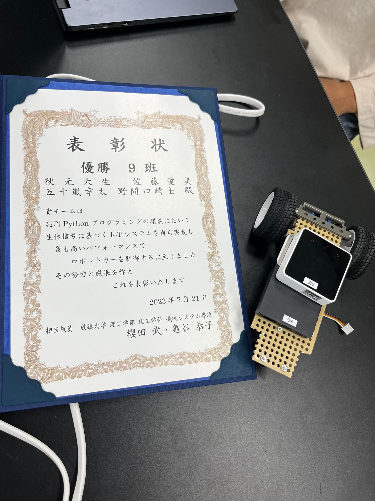

# **成果物**

※この成果物のページは未完成です。
 
 
 
五十嵐幸太の成果物です。 
僕は様々なものに興味があり、その中でもプログラミングと3DCGを主に勉強しています。 
最初に成果物の一覧、次に詳細をおいておきますのでよろしくお願いします。 
見てもらいたい順に置きます。
また、詳細の中にコードへのリンクも置いておきます。  

 
 <ins>成果物一覧折り畳み</ins>

 
 ## **成果物一覧**
 　以下が成果物の画像や動画です。サッと見たいときはここだけをご覧いただければと思います。 
 
 #### **制作物１**(C++) 
 光が壁で反射するプログラムです。M5Core2というハードに書き込みをしています。 
 加速度の表示もついています。  
  
  
  
 #### **制作物２**(python) 
 研究室の先生に聞いたところロボットカーの動画掲載の許可が降りなかったので、概要を詳細のところに記述します。 
 自分の書いたコードやその授業の課題概要などであれば公開してよいとのことなので、文章ベースであったり時間があればblenderなどで再現したアニメーションを作ってやろうかと思います。  
 ▼半年かけチーム単位でプログラミングを実装し、各班のコードを用いてレースをしました。優勝しました。
  
  
  
 #### **制作物３**(ポリゴンモデリング) 
 ▼部屋の中を作ったものです。正直改善点が多いですが、技術力は相当つきました。  
 最終結果 
  
 ▼作業のため部屋の中を明るくした途中過程 
  
  
  
 #### **制作物４**(CAD/ソリッドモデリング) 
 ▼グループで作成した扇風機のCADでの再現図全体です。 
  
 ▼個人で作成を担当した箇所です(速さの倍率を高くしていますが、羽は正常に動いています。) 
  
  

 

 
 <ins>詳細折り畳み(詳細まで見て頂ける方はここをクリック)</ins>

 
### **制作物１(C++)**
こちらは研究前の学習として、研究室で課題を出されたときに作成したものです。 
先生から提示された課題そのままではないですが、前提条件も含めて書き直すと課題はこのようなものでした。 
>下図のM5Core2と37個のLEDを用いてプログラミングを作成せよ(前提条件) 
>初期段階では中心の１つのみのLEDを点灯させ、M5Core2の画面に表示された上下左右のボタンを操作すると 
>その方向に光が移動するプログラムを作成せよ 
 
個人的にチャレンジをしてみたくてバグはあるものの実装できた追加機能はこちらです 
・速度・加速度で制御 
・位置をintではなくfloatで実装し、かつちゃんと表現する 
・空間分割をしてみる 
・壁で反射させる 
 

 
 思いついたけど(主に怠慢などで)実装できなかった機能(割とくだらないですがここをクリックで展開)

 
・伝わるか分かりませんけど、wii fit Plusの板を傾けて球を転がして穴に落とし、下層のステージをクリアしていくゲーム(ゲーム名:コロコロ玉入れ)のようなもの 
・シンプルに壁反射のバグ取り　主に角にぶつかったときにめり込む問題 
・加速度の360度表示(プログラミング的な実装は最初からしたが、ハードウェアが２点同時押しに対応しておらず、90度区切りでしか実装できなかった)
 
・空間分割を二分木構造にし、かつ可読性もあるコードに(現状まだO(n)なので、O(log n )にする(nはLEDの量とする)) 
・フィールド自体にも傾きをつける(位置に応じて加速度を操作) 
・何故か丁度いい感じになったのでバグを取っていないが、反射で謎に速度が落ちることがある問題を解消し、反射係数や摩擦を追加、もしくはきちんとした完全反射面を実装　これができなかったことが相当悔しい 
  

▼コードへのリンクです。M5Core2で動作します。C++です。
https://github.com/igarashikota/Deliverables/blob/main/%E8%B3%87%E6%96%99/%E5%88%B6%E4%BD%9C%E7%89%A91/%E5%88%B6%E4%BD%9C%E7%89%A91%E3%82%B3%E3%83%BC%E3%83%89%20.txt
 
 
### **制作物２**(python)
 
　学校の応用pythonという授業で出された課題です。課題は枝分かれのように小課題が多く、４人程度のグループで１学期通して行う大きなものでしたが、総括的な課題の概要は以下の通りです。 
  
> リモコンカーを左右の手につけた電極から送られてる筋電圧の数値を用いてリアルタイム制御制御せよ。 
> 各班ごとにコードを作成し、最終授業にて各自のコードを持ち寄りレースを行う。 
 
　先生から出された課題には文字列を利用しやすい形に正すという基本的なことから、ローパスフィルタやWiFiで文字列を送信することまで、様々な課題を出されました。僕が担当したのは送られてくる数値にローパスフィルタをかける箇所と、みんなが作成したコードを繋ぎ合わせるところ、細かいバグ対策やデバッグ作業でした。

    
