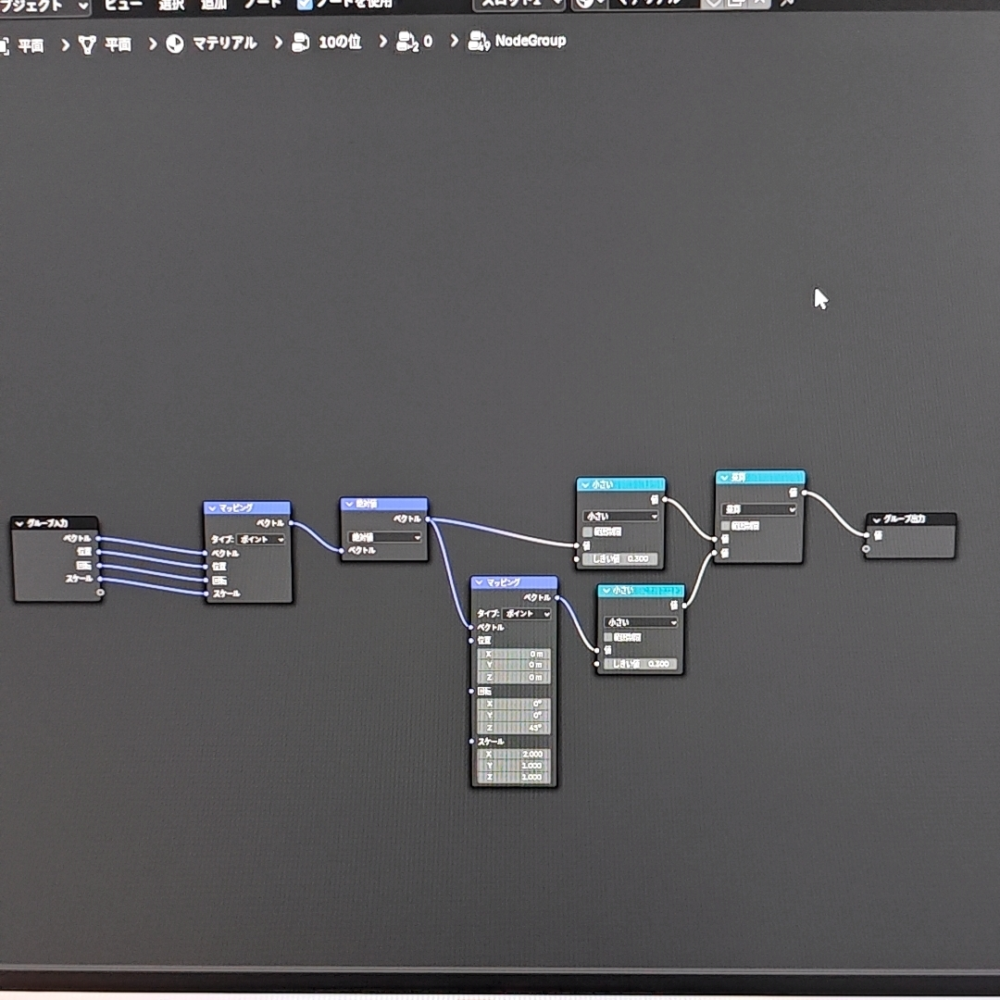

# **成果物**

※この成果物のページは未完成です。 
※画面の左右2分割の片方でご覧いただくと画像のキャプションが綺麗にいきます   

 ## 目次 
 ・ピックアップ制作物概要×４ 
 ・自己紹介や、持っているスキルに関して 
 ・制作物の詳細　(折り畳まれています) 
 ・その他の制作物概要(時系列/種類別)　(折り畳まれています) 
 　　・プログラミング 
 　　・3DCG 
 　　・その他絵など  

 ### あいさつ
　五十嵐幸太です。前半は成果物の概要、後半に詳細をおいておきますのでよろしくお願いします。また、実際のコードは詳細の中に置いておきます。 
　初期で折り畳みが開かれていない箇所は読み飛ばして頂いても大丈夫です。文章を読み飛ばしてざっと画像を眺めるだけでも割と分かると思いますので、ぜひお気軽に。   
 
 ## **ピックアップ制作物概要**

 
 <ins>成果物一覧折り畳み</ins>
 
 
 ### 説明
 　以下が成果物の画像や動画です。サッと見たいときはここだけをご覧いただければと思います。 
 
 ##### **制作物１**(C++) 
 光が壁で反射するプログラムです。M5Core2というハードに書き込みをしています。 
 加速度の表示もついています。 

 ▼課題に追加機能を盛り込んだ 
    

 
 ##### **制作物２**(python) 
 研究室の先生に聞いたところロボットカーの動画掲載の許可が降りなかったので、概要を詳細のところに記述します。 
 自分の書いたコードやその授業の課題概要などであれば公開してよいとのことなので、文章ベースでの説明であったり時間があればblenderなどで再現したアニメーションを作って載せてやろうかと思います。  
 
 ▼半年かけチーム単位でプログラミングを実装し、各班のコードを用いて障害物レースをしました。優勝しました。 
    

 
 ##### **制作物３**(ポリゴンモデリング) 
 部屋の中を作ったものです。正直見栄えなどの反省点が多いですが、技術力は相当つきました。 
 
 ▼最終結果 
   
 　　　　　　　　　　　　　　　　　　　　　　　　　　　作業のため部屋の中を明るくした途中過程▲   
 
 ##### **制作物４**(CAD/ソリッドモデリング) 
 ▼グループで作成した扇風機のCADでの再現図全体です。 
   
 　　　　　　　　　　　　　　　　　　　　　　　　　　　　　個人で作成を担当した箇所です▲ 

 

## 自己紹介や、持っているスキルに関して

 
<ins>自己紹介折り畳み</ins>
 

### 自己紹介
名　　五十嵐幸太 
所属　成蹊大学理工学部機械システム専攻　スマートニューロリハビリテーション研究室 
　　　成蹊大学　美術部 
　　　相模原ローターアクトクラブ 

  

### 持っているスキルや経験 

##### プログラミングの経験  
　プログラミングの最初の出会いは高校時代、技術の授業にて学んだ<ins>**ExcelのVBA**</ins>でした。授業で何かを作ろうといった課題で当時知っていたJump Kingというゲームに近いものを実装したくて、１からキャラ(ただの四角でしたが)の動作や床や壁判定、キャラの跳ね返りを実装したことを覚えています。基本的な実装が難しく足場やステージなどは作れませんでしたが、そのころからプログラミングに関して楽しさを感じていました。  
 
　大学では１年のころ<ins>**Jupyter Notebook**</ins>というアプリを用いて<ins>**Python**</ins>の学習が始まり基礎を習得、それが楽しかったので選択授業の応用Pythonプログラミングという授業を２年で取りました。詳しくは作成物2の詳細を見て頂きたいのですが(＊現在はまだ記載無し)、グループごとにロボットカーを動かすコードを書き、自分たちのコードが乗ったロボットカーを操作してレースするという授業でした。自らのコードの工夫が操作性にもろに表れるので、如何に操作しやすくするかや応答性など考えるのが楽しかった授業でした。研究室はこの授業を担当してくださった教授の研究室に配属することとなります。  
 
　研究室で出会ったのが <ins>**C++**</ins> でした。以前にUnityで <ins>**C#**</ins> を学ぼうとしたことはあったのですが、後述の3DCGの勉強の方に気を取られてしまい基礎を学習しただけで終わっていました。C++はPythonよりもきちんと変数を記述しないといけないなど違いが面白く、またゲームにも使用される言語ということもあって今積極的に学習している言語です。研究室の中の配属グループは開発系の研究グループですし、先輩からC++のほかノードプログラミングやHTML/Javascriptなども勉強した方が役に立つとのことでしたのでこちらも現在勉強しています。  
 
　<ins>**Paiza**</ins>に出会ったのはどこかの広告でプログラミングを絡めたゲームがあると知ってでした。たしか大学1年のころだったと思います。結局そのときは会員登録をしただけでゲームはやらずじまいでした。スキルチェックがかなりの勉強になるなと気づいてからは、半分勉強および解いた時の達成感のため、もう半分は就活目的の為に利用しています。   

 ▼研究室で貸与されたM5Core2という系と周辺機器です！C++の学習に使いました。  
 
 　  

 ▼blender(3DCG)でもノードプログラミングは頻繁に使います。これはアニメーションとしての使い方ですが、ものの色や質感や法線ずらし、アニメ風にしたり色相をずらしたりとよくノードを組みます。  
 
 　  
 
 
    

##### CGの経験  
　<ins>**ソリッドモデリング**</ins>の出会いは大学の1年で受けた<ins>**CAD/CAM**</ins>の授業でした。どうにも性に合っており、課題でも好きなゲームの武器をギミックを入れて作っていました。このときは**Creo parametric**、のちに<ins>**Fusion360**</ins>というアプリを経験しました。2年で受けたCAD/CAM2ではグループで先生から渡された扇風機を分解し、CAD上で再現するという課題なども行いました。(それが制作物4) 首振り機構やギアボックスの中の減速機構なども担当し、ソリッドモデリングやCADへの知識も深まりました。また大学にある3Dプリンターで部品や置物を印刷なども試し、プリンターを管理している先生との話の中で様々なことも知れたいい経験でした。  

　<ins>**ポリゴンモデリング**</ins>を本格的に始めたのは１年ちょっと前(現在commit時点)、2024年の最初の方です。バイトで頂いたお金をほぼ全部投入し<ins>**blender**</ins>のためにデスクトップパソコンを買ったことに起因します。このときパソコン選びを失敗したくなく、かなりパソコンの知識も深まったのは良い副産物でした。CADの経験があったので背景モデリングは少々得意でしたが、折角と思いソリッドモデリングでは苦手なキャラモデリングをしたところ凝り性が発動してハマり、現在は趣味としても専らキャラモデリングをしています。  
 
　blenderのしくみや分からない単語などをそのままにしたくなくCGエンジニアの教科書をBOOKOFFで買い勉強、その本は検定に対応していたので同年8月<ins>**CGエンジニア検定**</ins>エキスパートの習得に至りました。ポリゴンデータなどから画面に表示するまでのワークフローや、BSDF(双方向散乱分布関数)の知識が特にめちゃくちゃ面白かったです。  

▼　CADに出会った授業で作った中間課題と期末課題です。スプラトゥーンシリーズの武器です。 
 　  

▼　blenderでモデリングをしています。右は現在作っているキャラモデリングです。絶賛髪の毛に苦戦しています。 
 　  

 

## 詳細

 
 <ins>詳細折り畳み</ins>

  
 
### 制作物１(C++)

#### 概要
こちらは研究前の学習として、研究室で課題を出されたときに作成したものです。 
先生から提示された課題そのままではないですが、前提条件も含めて書き直すと課題はこのようなものでした。 
>下図のM5Core2と37個のLEDを用いてプログラミングを実装する課題 
>初期段階では中心の１つのみのLEDを点灯させ、M5Core2の画面に表示された上下左右のボタンを操作すると 
>その方向に光が移動するプログラムを作成せよ

 

#### 追加した機能について
個人的にチャレンジをしてみたくてバグはあるものの実装できた追加機能はこちらです  

● 速度・加速度で制御 
● 位置をintではなくfloatで実装し、かつちゃんと表現する 
● 空間分割をしてみる 
● 壁で反射させる  

思いついたけど(主に怠慢などで)実装できなかった機能
 
● 伝わるか分かりませんけど、WII fit Plusの板を傾けて球を転がして穴に落とし、下層のステージをクリアしていくゲーム(コロコロ玉入れ)のようなもの 
● シンプルに壁反射のバグ取り　主に角にぶつかったときにめり込む問題 
● 加速度の360度表示(プログラミング的な実装は最初からしたが、ハードウェアが２点同時押しに対応しておらず、実質90度区切りでしか実装できなかった) 
● 空間分割を二分木構造にし、かつ可読性もあるコードに(現状まだO(n)なので、O(log n )にする(nはLEDの量)) 
● フィールド自体に傾きをつける(位置に応じて加速度を操作) 
● 何故か丁度いい感じになったのでバグを取っていないが、反射で謎に速度が落ちることがある問題を解消。その上で反射係数や摩擦を追加、もしくはきちんとした完全反射面を実装　これができなかったことが相当悔しい 
● 光の位置はコードのステップに依存してしまっている。for文の最初と最後間で時間計測し、その時間を係数として位置を加算する値に対して乗算したかった。(これもゲームエンジンに使われている手法で、処理速度が変わってもユーザーの体験が変わりにくくなる) 
● 今回は光の個数が一つなので意味は無いが、クラスを実装した経験がまだないので練習として実装してもよかった  

▼改めて実装の様子です。 
  

▼コードへのリンクです。./資料/制作物1/制作物1コード.txtへのリンクですので直接階層を潜っていただいても同様のデータが閲覧できます。 
Alduino IDE 2.3.4で作成しました。C++です。
https://github.com/igarashikota/Deliverables/blob/main/%E8%B3%87%E6%96%99/%E5%88%B6%E4%BD%9C%E7%89%A91/%E5%88%B6%E4%BD%9C%E7%89%A91%E3%82%B3%E3%83%BC%E3%83%89%20.txt   

#### 難しかった点
 　この課題が難しい点は、下図のようにLEDが変な形に並んでいることです。具体的には、黒鉛の一層のような、六方最密構造の平面版のような、ハニカム構造のようなLED配列になっています。面白そうだったので、課題としては全く指定されていませんが、ゲームエンジンをイメージした追加機能を入れてやろうと思ったことがこのコードに繋がっています。  
  
▼変な形状のLED 
   

#### まとめ
　フローチャートは以下のようになります。ボタンが押されているかを確認し、光の位置を計算します。そのあとその光の位置に応じて4つに空間分割を行って処理の短縮を図っています。その後該当するエリアの壁のみ壁当たり判定をしたり輝度計算を行い、該当しないエリアは一部の処理だけした後に全体をLEDに反映させています。  
 
 ▼フローチャート 
    

 加速度表示は全体を一様に光らせることで成しています。方向はこの色相環の、中心からの方向の色と対応しています。これは実は3DCGの分野における"ノーマルマップ"というものから着想を得たもの(細かい話ですが計算自体は結構違う)です。プログラミング以外にも学んでいたことによってアイデアが広がったいい例かなぁと思っています。 
 ▼色相環 
    

### 制作物２(python)
 

#### 概要
　学校の応用pythonという授業で出された課題です。課題は枝分かれのように小課題が多く、４人程度のグループで１学期通して行う大きなものでしたが、総括的な課題の概要は以下の通りです。  
 
> リモコンカーを左右の手につけた電極から送られてくる筋電圧の数値を用いて、リモコンカーをリアルタイムで制御せよ。 
> 各班ごとにコードを作成し、最終授業にて各自のコードを持ち寄りレースを行う。  

　先生から出された課題には、文字列を利用しやすい形に正すという基本的なことから数値列のローパスフィルタやWiFiで文字列を送信することまで、様々な課題を出されました。僕が担当したのは、送られてくる数値にローパスフィルタをかける箇所、みんなが作成したコードを繋ぎ合わせる作業、細かいバグ対策やデバッグ作業などでした。   

#### 実際のコード
　早速ですがコードです。全班共通しているのは、Wi-Fiを通じたシリアル通信で文字列("数値,数値"の形)を受け取り、移動平均など何らかの処理を施し、定期的に文字列("数値,数値"の形)を送信し返すという感じです。 
　僕たちの作ったコードは4ブロックに分かれていて、順に 
　　1ブロック目　importなど 
　　2ブロック目　筋電力の最大値を測り個人にカスタマイズするためのプログラム(実行しなくても4ブロック目は実行可能) 
　　3ブロック目　2ブロック目を実行するためのもの 
　　4ブロック目　メインプログラム 
 となっています。pythonは対話型言語なので、2,3ブロック目を飛ばしても大丈夫なように対話型という仕様を活用した感じです。 

 ▼コードです
   

　具体的な自分の担当した箇所は、2番目のブロック全体と4番目(メインプログラム)の一部です。それぞれのブロックの下にコンソールログが表示されるので、そこに複数の情報が1行で更新されていくようにプログラムを組みました。 

 

### 制作物3(ポリゴンモデリング)
 

#### 概要
　こちらは大学の美術部の企画で作成したものです。企画参加者同士で好きなキャラを出し、互いにキャラを交換して書きあうといったものでした。僕はアイドルマスターの浅倉透さんを担当することになりました。正直に言ってしまうと作品としてまだまだだと思っています。全体的なフローは間違ってなかったと思うし、技術力は上がりましたがとても悔しい記憶です。
　コンセプトについてです。浅倉透さんはアイドルで、趣味は読書や映画鑑賞とのことです。公式ではあまり映画鑑賞をしている絵が見つからなかったので、浅倉さんが家で映画を楽しんでいるような作品にしたくて制作しました。作品は以下の通りです。  

▼　レンダー結果 
   

▼　ライティング変えたもの 
  

#### 反省と感想
　コンセプトはよかったと思いますが、結果はあまりよくなかったと思います。庭の木陰で読書をしているなどにすれば、ゲームの色味に合っててよかったのかななどと今更感じます。本番ではテレビの明かりのみのライティングにしましたが、なんなら部屋の電気がついた下側の画像の方が良いまでありました。いつかリメイクします。 
 　小物なども色々置きましたが、時間がなく少し整頓されすぎた感じになってしまいました。生活感を出すにはもう少しものを置いた方がよかったと思います。雑誌の表面の凹凸感などは表面の法線を弄ったものですが、こちらはかなり良い感じになったと思います。  

▼　雑誌と物のワイヤーフレームです。
　  

#### シェーダーやマテリアル
(わかりにくい単語で説明してしまいます。すみません。)
 また、シェーダーをEEVEEで色々セルルック(アニメ風の見た目)にしたりしましたが、影のリアルさを求めて結局Cyclesにしました。画像処理の方法でCyclesのレンダリング後にセルルックにする手法は疑似輪郭が綺麗にいかずにノイズがのってしまうので諦めました。ですがそのとき研究した手法はかなり今後の参考になりました。具体的にはBSDFをカラーに変更、色相・彩度・輝度に分離し、色相以外をカラーランプでステップ関数のように刻むといった方法で色相を保持しています。

▼　セルルック研究　三色のライトをそれぞれの方向から当てています。 
  

　実力不足だと感じたのは目です。上の画像を見て頂ければわかるのですが、白目は現実の人間の構造とは違い窪ませているので、どうしても暗くなってしまいます。おそらく入射光などを参考に色を決定すべきなのでしょうが、やり方が分からずに今回は本番の環境で自然に見えるように目を発光させて調節する力業を取っています。ここの問題もいつか解決したいです。 
 
  

### 制作物4(ソリッドモデリング)
 

   

 

## その他の制作物概要

 
<ins>その他の制作物概要折り畳み</ins>

 ### 説明
  
 僕の制作物とちょくちょく織り交ぜながら、何をどう学んでいったのかを列挙していきます。  

 ### プログラミング

 
　中高のころ、技術の授業でexcelのVBAを習い、プログラミングに出会いました。大学に入ってからPythonの基礎を学び、2年で応用Pythonプログラミングの授業にてかなり自由度の高いグループでの開発をしました。 
　2024年1月あたりにはデスクトップPCを買い、blenderを始めました。モデリングもそうですが、物体の形や表面の情報などにノードを使ってプログラミングをすることができます。↓のようなノードで、画面に映っている葉っぱの表面や凹凸感を表現しています。 

▼　作品の部屋の中に置く予定のストレチアの葉っぱのマテリアルのノード(左)と、葉っぱ１枚だけモデリングして他をノードで作った植物です(右)。左の画像の左下に映っている白黒の画像は、葉の端の凸凹や切れ目(白は透過するように扱う)の係数として使っています。他の葉は違う画像で制御することで、バリエーションを増やす工夫です。 
　  

▼　3DCGの検定ですが、実態はプログラミング面の恩恵の方がデカかったです。端的に言うと、ゲームエンジンの作り方(シェーダーなど)やそのほか3DCGの知識が学べます。 
  

▼　これもノードプログラミングです。 
　  

3年になってから研究室に配属され、C++の学習が始まりました。Pythonがいかに楽にプログラミングを楽にできるようになっていたか分かり、違いが面白かったです。  

▼　研究室で配布されたアルディーノ系の機器です。 
  

▼　課題を行ったものです。 
　  

  

 ### 3DCG
 
 
  
　  
　  
  
　  
   
　  
　  

  

 ### 絵
  
  
  
  
 

  

                        
